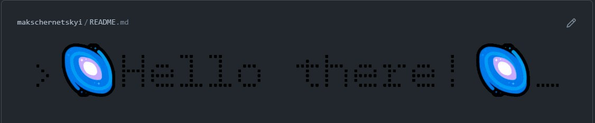

<h1>gif made of html</h1>
 
It's the code responsible for creating "Hello there" in my readme header
 

 
<h2>what I've done step by step:</h2>
 
-made animation in html
-recorded screen with the animation on
put it into photo editior, where I cropped it and saved as image
sequence to folder "./frames"
-then removed green screen background with python script
-then with photo editor put it again together into .gif file